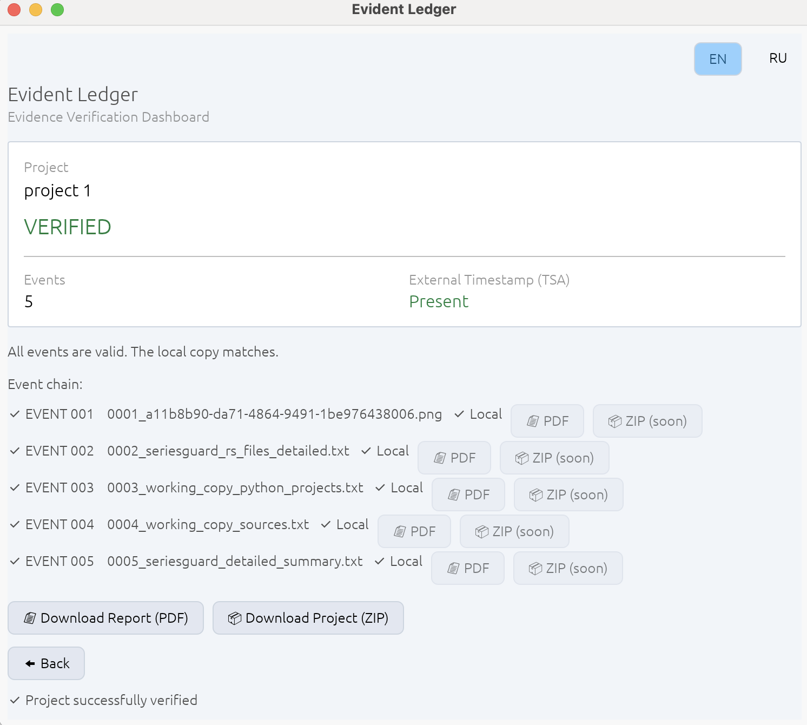
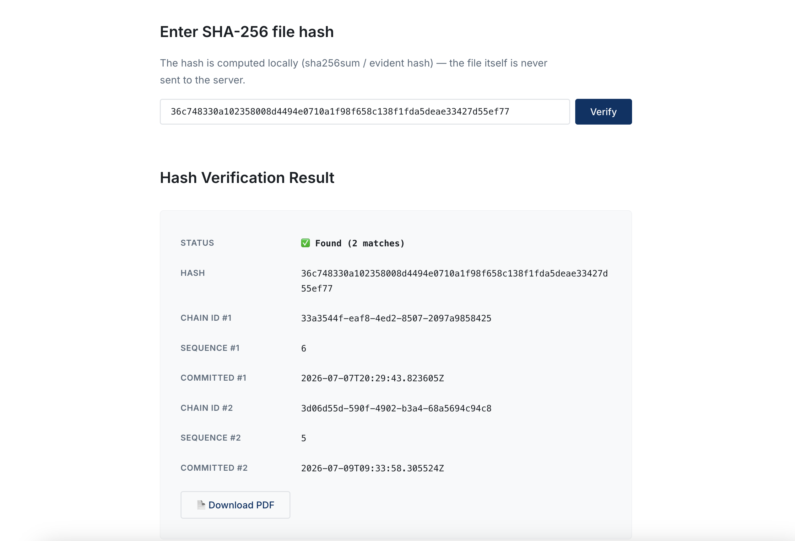

# Evident Ledger

**Tamper-evident evidence infrastructure for high-stakes digital records.**



**Stop relying on mutable internal logs as your only source of truth.**

Evident Ledger transforms business documents, software artifacts, datasets, AI model outputs, and digital records into independently verifiable evidence packages.

Designed for regulated industries, AI development, software engineering, and compliance workflows, Evident Ledger creates cryptographic proof that a record existed in a specific form at a specific point in time across jurisdictions.

---

# ⚡ Quick Start: See it in Action

Don't just take our word for it. Review the type of evidence package generated by Evident Ledger.

## Evidence Artifacts

* 📄 **[Evidence Snapshot](docs/samples/evidence_snapshot.pdf)**  
  Complete verification summary containing ledger integrity information, cryptographic proofs, and verification metadata.

* 🛡️ **[Hash Attestation Certificate](docs/samples/hash-attestation-66d244d59319785d.pdf)**  
  Independent certificate demonstrating hash registration and timestamp evidence.

---

# 🏗 Why Evident Ledger?

Traditional logging systems store evidence inside the same systems that generate and control the records.

This creates an authenticity gap during audits, investigations, or disputes.

Evident Ledger separates record creation from later verification.

| Feature | Traditional Logs | Evident Ledger |
| --- | --- | --- |
| Integrity | Database-dependent | Cryptographically verifiable |
| Verification | Requires internal system access | Independent verification |
| Audit History | Mutable records | Tamper-evident proof chain |
| Cloud Dependency | Usually required | Local-first architecture |

---

# 🛡 Trust Model

Evident Ledger relies on cryptographic verification rather than organizational trust.

## Core Principles

- **SHA-256 Cryptographic Fingerprinting**  
  Generates unique fingerprints for protected records.

- **Tamper-evident Event Chains**  
  Hash-linked records make unauthorized changes detectable.

- **Merkle Proof Structures**  
  Provides efficient integrity verification of evidence history.

- **RFC 3161 Trusted Timestamping Support**  
  Enables independent time evidence through Timestamp Authority integration.

- **Offline Verification**  
  Proof packages can be verified without access to the original system.

---

# 🚀 How It Works

## 1. Commit

A document, artifact, or digital record is fingerprinted locally.

The original file remains under customer control.

## 2. Anchor

The system creates an evidence record containing:

- Cryptographic hash
- Event metadata
- Chain information
- Timestamp information

## 3. Verify

Anyone with the proof package can independently verify integrity.

No access to the original database is required.



---

# 📊 Evidence Verification Example

A generated evidence package contains:

## Ledger Integrity

Merkle Root:  
8658e621dfaed6f55100e487c4d2d9da133268c5f3907d254c73331cbf784090

## Digital Signature

c2a2b12bc665888c8f633e461cd6c6f85b72fdbf8386a78ab7a87a8ade77814e

## External Timestamp

RFC 3161-compatible timestamp verification support.

## Independent Verification

Example:

```bash
evident verify proof.json
```

---

# 🛠 Quick Start (CLI)

Build the client:

```bash
cargo build --release
```

Initialize identity:

```bash
./target/release/evident init
```

Protect a document:

```bash
./target/release/evident commit document.pdf --chain <chain_id>
```

Verify independently:

```bash
./target/release/evident verify ~/.evident/proofs/<chain_id>/proof.json
```

---

# 📚 Documentation

Technical, security, evidence, and legal documentation:


## Technical Documentation

- [Architecture](docs/cli_product_layer_tz.md)

- [Protocol Specification](docs/protocol_v0.1.md)

- [Proof Schema](docs/proof_v1.schema.md)

- [Security Policy](SECURITY.md)


## Evidence & Legal Documentation

- [Technical Whitepaper](docs/whitepaper/Evident_Ledger_Technical_Whitepaper_v1.0.md)

- [Evidence Assurance Model](docs/specifications/Evidence_Assurance_Model_v1.0.md)

- [Legal Brief for Attorneys](docs/legal/Evident_Ledger_Legal_Brief.md)

---

# 🔐 Security Philosophy

The system that creates a record should not be the only system trusted to prove that record.

Evident Ledger enables organizations to create portable, independently verifiable evidence artifacts designed for audits, investigations, compliance reviews, and dispute preparation.

---

# ⚖️ Legal Position

Evident Ledger is a technical infrastructure tool designed to support evidence preservation, provenance, and verification workflows.

It does not replace legal advice, compliance assessment, or professional judgment.

Legal effect, regulatory acceptance, and admissibility depend on jurisdiction, applicable regulations, contractual requirements, and specific case circumstances.

The platform is designed to support integrity principles used in digital evidence workflows, including authentication concepts in the United States and electronic trust frameworks such as eIDAS in the European Union.


---

# The Principle

**The truth is not stored.  
The truth is proven.**
