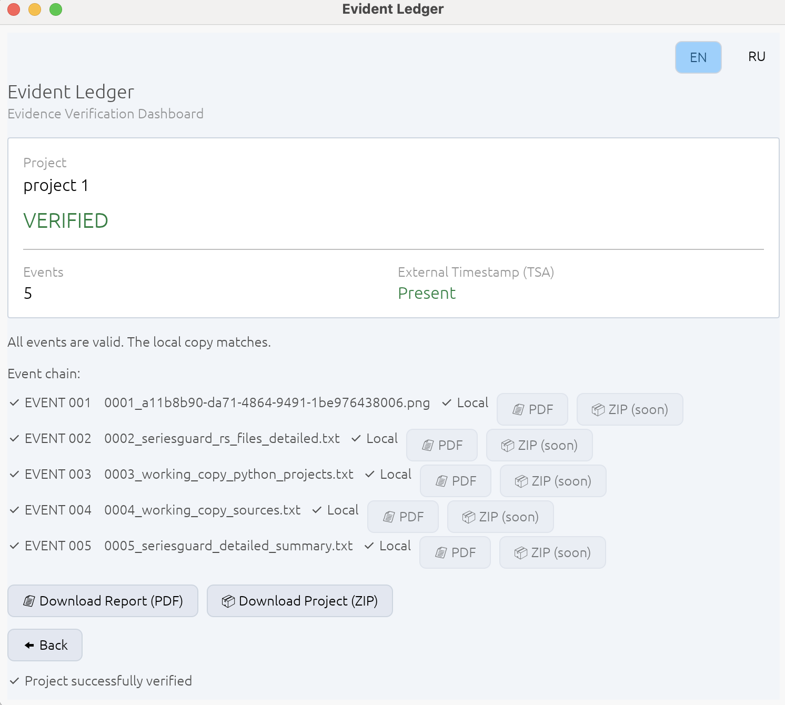

# Evident Ledger

**Tamper-evident evidence infrastructure for high-stakes digital records.**



**Stop relying on mutable internal logs as your only source of truth.**

Evident Ledger transforms business documents, software artifacts, datasets, AI model outputs, and digital records into independently verifiable evidence packages.

Designed for regulated industries, AI development, software engineering, and compliance workflows, Evident Ledger creates cryptographic proof that a record existed in a specific form at a specific point in time across jurisdictions.

## Project Status

Evident Ledger publishes release-candidate milestones while continuing
development on `main`.

The `main` branch is the current public baseline. Advanced security
hardening, TSA verification improvements, identity signing, and release
governance work from the release-candidate lines has been merged into
`main`. Development on `main` continues beyond those tagged RCs toward
the next stable release.

Published release candidates:

- `v1.2.0-rc1` — TSA/RFC3161 verification hardening and fail-closed startup guards.
- `v0.13.8-rc1` — signing key governance and related security lifecycle work.
- `v0.13.7-rc2` — previous release-candidate milestone (TSA proof-boundary and identity/billing findings).

These versions are published as Git tags and GitHub Releases. They remain
valid historical pre-releases and are ancestors of `main`; treat `main`
(and future stable tags) as the source of truth for current code, while
Releases document the RC milestones.

See published candidates in the
[GitHub Releases](https://github.com/vesmot74-code/evident-ledger/releases)
section.

## Local development

Start the local database and Evident Ledger server:

```bash
./scripts/dev-server.sh
```

Run the CLI:

```bash
./scripts/dev-cli.sh --help
```

Local configuration is stored in `.env` and is not committed to Git.
Use `.env.example` as the configuration template.

---

# ⚡ Quick Start: See it in Action

Don't just take our word for it. Review the type of evidence package generated by Evident Ledger.

## Evidence Artifacts

### Local Evidence Reports (CLI, owner access)

* 📄 **[Evidence Snapshot](docs/samples/evidence_snapshot.pdf)**  
  Full verification report generated locally via `evident report generate`.
  Contains complete ledger integrity information, cryptographic proofs, and
  verification metadata. Requires access to the local proof/chain data.

### Public Certificate (HTTP, no authentication)

* 🛡️ **[Public Certificate](docs/samples/public-certificate-sample.pdf)**  
  Existence-only confirmation available at `GET /public/verify/:public_proof_id/certificate.pdf`.
  Discloses registration time, TSA class, and integrity state only — no
  chain, event, or Merkle data, per [SECURITY.md](SECURITY.md).

## Evidence Export and Backup Model

Evidence Export and Server Backup are not copies of your original files.
They preserve cryptographic evidence of an audit chain.

### Evidence Export (All Plans)

Evidence Export creates a local cryptographic evidence snapshot of a chain.

The snapshot contains:

- hashes
- digital signatures
- event order
- chain metadata
- verification information

**This export does not contain original user files.**

It confirms that records existed, that events occurred in a specific sequence, and that the chain was intact at the time of export. It is not a copy of the user's documents.

Exported snapshots are stored locally at `~/.evident/backups/`.

### Server Backup (Vault+)

Server Backup is available on **Vault** and **Identity** plans.

It is for availability and recovery: keeping evidence packages available if local application data is lost.

**Server Backup stores evidence snapshots, not original user files.**

Evident Ledger is not a file-hosting or document cloud. Original files remain wherever the customer placed them.

---

# 🏗 Why Evident Ledger?

Traditional logging systems store evidence inside the same systems that generate and control the records.

This creates an authenticity gap during audits, investigations, or disputes.

Evident Ledger separates record creation from later verification.

| Feature | Traditional Logs | Evident Ledger |
| --- | --- | --- |
| Integrity | Database-dependent | Cryptographically verifiable |
| Verification | Requires internal system access | Independent verification |
| Audit History | Mutable records | Tamper-evident proof chain |
| Cloud Dependency | Usually required | Local-first with optional managed backup |

---

# 🛡 Trust Model

Evident Ledger relies on cryptographic verification rather than organizational trust.

## Core Principles

- **SHA-256 Cryptographic Fingerprinting**  
  Generates unique fingerprints for protected records.

- **Tamper-evident Event Chains**  
  Hash-linked records make unauthorized changes detectable.

- **Merkle Proof Structures**  
  Provides efficient integrity verification of evidence history.

- **RFC 3161 Trusted Timestamping Support**  
  Enables independent time evidence through Timestamp Authority integration.

- **Offline Verification**  
  Proof packages can be verified without access to the original system.

---

# 🚀 How It Works

## 1. Commit

A document, artifact, or digital record is fingerprinted locally.

The original file remains under customer control.

## 2. Anchor

The system creates an evidence record containing:

- Cryptographic hash
- Event metadata
- Chain information
- Timestamp information

## 3. Verify

Anyone with the proof package can independently verify integrity.

No access to the original database is required.

## What Evident Ledger Does Not Store

Evident Ledger is not a file store and does not replace customer document repositories.

The system does **not** store original user files as part of the evidence chain.

What it stores is cryptographic proof that those records existed and remained intact:

- cryptographic proofs
- hashes
- signatures
- chain information

Original files stay under customer control. Evident Ledger stores evidence of their existence and integrity, not the files themselves.

---

# 📊 Evidence Verification Example

A generated evidence package contains:

## Ledger Integrity

Merkle Root:  
8658e621dfaed6f55100e487c4d2d9da133268c5f3907d254c73331cbf784090

## Digital Signature

c2a2b12bc665888c8f633e461cd6c6f85b72fdbf8386a78ab7a87a8ade77814e

## External Timestamp

RFC 3161-compatible timestamp verification support.

## Independent Verification

Example:

```bash
evident verify proof.json
```

---

# 🛠 Quick Start (CLI)

Build the client:

```bash
cargo build --release --bin evident
```

Initialize local identity:

```bash
./target/release/evident init
```

Set your API key (create one in Dashboard → Account → API Keys):

```bash
export EVIDENT_API_KEY=<your_api_key>
```

Create a chain:

```bash
./target/release/evident new-chain
```

Protect a document:

```bash
./target/release/evident commit document.pdf --chain <chain_id>
```

Verify independently:

```bash
./target/release/evident verify ~/.evident/proofs/<chain_id>/proof.json
```

Or verify using the latest local proof for a chain:

```bash
./target/release/evident verify --chain <chain_id>
```

Optional report:

```bash
./target/release/evident report generate <chain_id>
```

Export a local evidence snapshot (all plans). This does not copy original files:

```bash
evident backup export --chain <chain_id>
```

Create a server-side backup (Vault+):

```bash
evident backup create --chain <chain_id>
```

Other CLI commands: `status`, `backup`, `account`, `account info`, `key status`, `key info`, `hash`, `version`.

Run `evident --help` for the full command list.

---

# 🧩 Platform Components

| Component | Role |
| --- | --- |
| **CLI** | Local-first commit, chain management, offline verify, account/key helpers (`evident`) |
| **Verification** | Private `/v1/verify` and public `/public/verify` pipelines; offline proof verification |
| **API** | HTTP `/v1` evidence API, account APIs, identity key registration |
| **Dashboard** | Session-based web UI for subscription, usage, API keys, and identity |
| **Identity Layer** | User-owned Ed25519 keys: generate locally, register with proof-of-possession, sign, verify, revoke |
| **Billing Layer** | Tariff plans, Paddle checkout/webhooks, subscription lifecycle and enforcement |

Normative models:

- [API](docs/API.md)
- [Authentication](docs/AUTH_MODEL.md)
- [Billing](docs/BILLING_MODEL.md)
- [Identity](docs/IDENTITY_MODEL.md)
- [Verification](docs/VERIFY_MODEL.md)

---

# 👤 Account and Subscription

Accounts authenticate with API keys (`X-API-KEY`) or Dashboard sessions.

Subscription state is orthogonal to the active tariff:

- Plans: `free`, `legal`, `vault`, `identity`
- Statuses: `none`, `active`, `past_due`, `canceled`
- Paid upgrades via Paddle (Dashboard overlay checkout); state updates from signed webhooks

## Storage capabilities

| Plan | Local Evidence Export | Server Backup |
| --- | --- | --- |
| Free | ✓ | — |
| Legal | ✓ | — |
| Vault | ✓ | ✓ |
| Identity | ✓ | ✓ |

Local Evidence Export is available on every plan. Server Backup is Vault+ only and stores evidence snapshots, not original files.

Details: [docs/AUTH_MODEL.md](docs/AUTH_MODEL.md), [docs/BILLING_MODEL.md](docs/BILLING_MODEL.md).

---

# 🔑 Identity

User identity keys are generated on the client. Private keys never leave the device.

Supported flows:

- Local key generation: `evident init` → `~/.evident/identity.key` / `identity.pub`
- Register / revoke keys via Dashboard → Identity (or HTTP `/accounts/identity/keys/*`)
- Optional user signatures on events (API / identity-enabled plans)
- Verification of historical identity signatures
- Permanent revoke (does not invalidate existing proofs)

Note: there is no `evident identity` subcommand. API key helpers are `evident key status` / `evident key info`.

Details: [docs/IDENTITY_MODEL.md](docs/IDENTITY_MODEL.md).

---

# 📦 Release Artifacts

| Artifact | Description |
| --- | --- |
| `evident` | Primary CLI (init, commit, verify, account, keys, report) |
| `evident-ledger` | HTTP API / Dashboard server |
| `evident-verify` | Standalone verification binary |
| Sample PDFs | [Evidence Snapshot (local)](docs/samples/evidence_snapshot.pdf), [Public Certificate (HTTP)](docs/samples/public-certificate-sample.pdf) |

Build release binaries:

```bash
cargo build --release --bin evident --bin evident-ledger --bin evident-verify
```

---

# 📚 Documentation & Product Materials

Product-facing materials for users, companies, auditors, and counsel. Implementation details live in `docs/`.

### Product Overview

- [Technical Whitepaper](docs/whitepaper/Evident_Ledger_Technical_Whitepaper_v1.0.md)
- [Evidence Assurance Model](docs/specifications/Evidence_Assurance_Model_v1.0.md)
- [Legal Brief for Attorneys](docs/legal/Evident_Ledger_Legal_Brief.md)

### User Materials

- [CLI installation](docs/CLI_INSTALLATION.md)

### Product PDFs

- [Evidence Snapshot (local report)](docs/samples/evidence_snapshot.pdf)
- [Public Certificate](docs/samples/public-certificate-sample.pdf)
- [Technical Whitepaper (PDF)](docs/whitepaper/Evident_Ledger_Technical_Whitepaper_v1.0.pdf)

### Interface & UX

- [Dashboard](docs/assets/dashboard.png)

### Audits

- [Backup Tiering](docs/audits/backup-tiering.md)
- [Storage Transparency](docs/audits/storage-transparency.md)

### Technical Documentation

- [Security Policy](SECURITY.md)

---

# 🔐 Security Philosophy

The system that creates a record should not be the only system trusted to prove that record.

Evident Ledger enables organizations to create portable, independently verifiable evidence artifacts designed for audits, investigations, compliance reviews, and dispute preparation.

---

# ⚖️ Legal Position

Evident Ledger is a technical infrastructure tool designed to support evidence preservation, provenance, and verification workflows.

It does not replace legal advice, compliance assessment, or professional judgment.

Legal effect, regulatory acceptance, and admissibility depend on jurisdiction, applicable regulations, contractual requirements, and specific case circumstances.

The platform is designed to support integrity principles used in digital evidence workflows, including authentication concepts in the United States and electronic trust frameworks such as eIDAS in the European Union.


---

# The Principle

**The truth is not stored.  
The truth is proven.**
